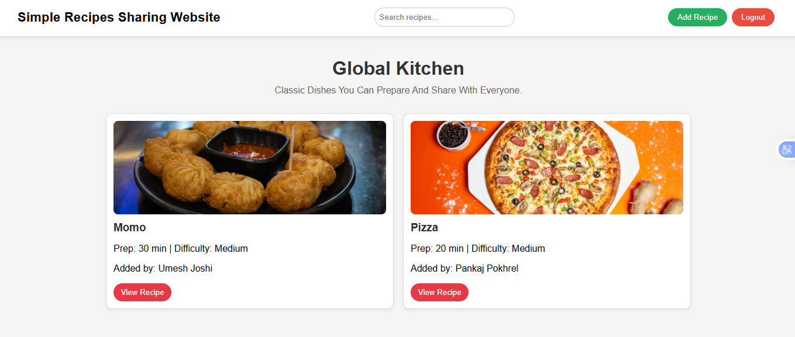

# 🍳 Recipe App

A full-stack recipe sharing web application where users can register, log in, submit recipes, and browse approved recipes. Chefs can review submitted recipes and approve or reject them.

## 🌐 Live Demo

https://recipe-app-beryl-kappa.vercel.app/

## Screenshot



## ✨ Features

* User registration and login
* Password hashing with bcrypt
* Submit recipes
* Browse approved recipes
* Chef dashboard
* Approve or reject submitted recipes
* MongoDB database integration
* RESTful API
* Responsive frontend

## 🛠️ Tech Stack

**Frontend**

* HTML5
* CSS3
* JavaScript

**Backend**

* Node.js
* Express.js
* Mongoose
* bcrypt
* CORS

**Database**

* MongoDB Atlas

**Deployment**

* Vercel


## ⚙️ Run Locally

### 1. Clone the repository

```bash
git clone https://github.com/sam123227/recipe-app.git
cd recipe-app
```

### 2. Install backend dependencies

```bash
cd api
npm install
```

### 3. Create `.env`

Create `api/.env`:

```env
MONGO_URI=your_mongodb_connection_string
PORT=8081
```

Never commit `.env` to GitHub.

### 4. Start the backend

```bash
node index.js
```

The backend runs on:

```text
http://localhost:8081
```

